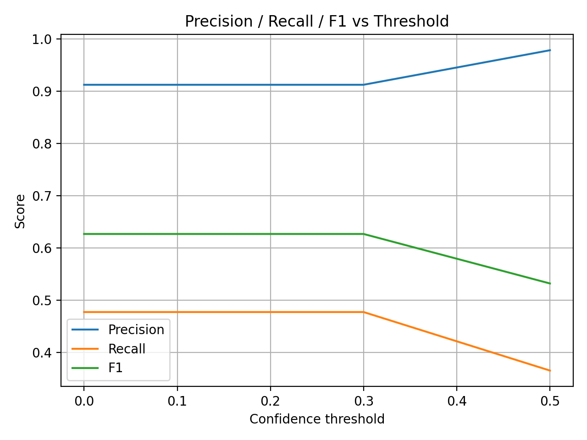

# Computer Vision Railway Validation

## Introduction
This project implements an AI agent for railway computer vision systems, including validation.  
The agent processes railway video footage and runs object detection algorithms to detect people in the vicinity of the railway under diverse environmental conditions. Real-life application of such a system can be life-saving.  
Validation focuses on both quantitative performance metrics and visual analysis.

## Validation Dataset
The database used in this project is **RailGoerl24**, introduced in:  
[RailGoerl24: Görlitz Rail Test Center CV Dataset 2024](data.fid-move.de/dataset/railgoerl24)

The annotated dataset comprises **61 video sequences**. These sequences include **12,205 frames** with **33,556 bounding box annotations of persons**. The video sequences were recorded at a frame rate of **25 fps**, and every **15th frame** starting from frame **0** was extracted for annotation purposes.

It was chosen since it is the most novel database of railway images; it is sequential, and therefore videos can be created from the sequence of images. It represents diversity of recorded human beings for a railway operational design, containing single persons, groups, and children, with positions of standing, crouching, and laying, under different lighting conditions. It introduces great diversity and aims to avoid bias for the model.  
Additionally, the images resemble real-life situations since they are train forward-facing, unlike, for example, UAV-RSOD (2024), which is captured via drone.

Since the purpose of this project is to demonstrate my validation capabilities rather than training a CV model, I curated a subset of the dataset to decrease code runtime. The subset was selected to ensure coverage of rare but high-risk scenarios such as persons lying on or between rails, in addition to standard pedestrian cases:

- **6** videos of people lying down / fallen (Person liegend / gestürzt)  
- **3** videos of people sitting / crouching (Person-hockend) (hard detection)  
- **2** videos with difficult lighting (Gegenlicht)  
- **5** videos of people crossing  
- **7** videos of blurry people, groups, and children (Fuzzy-KinderMenschengruppe1)  

**Total: 23 videos**

## Model Selection
I used a pre-trained state-of-the-art YOLO model for object detection. It can be fine-tuned using the same dataset (after dividing into train, validation, and test sets) to achieve better results.  
The exact version of YOLO selected is **YOLOv8n**. It was chosen after considering the use case in railway scenes, where people often appear:

- very small  
- near the horizon  
- partially occluded  

**YOLOv8s** was selected since it is known to have:
- a strong feature extractor  
- good recall  
- few false negatives  

## Ground Truth and Comparison
In RailGoerl24, annotations are provided in **XML** format. The model used for training and inference (YOLO) expects predictions as **one-line text files**. Therefore, in order to perform validation and calculate metrics, I save the predictions of my own model in **JSON** format.

Validation therefore requires parsing XML annotations and JSON files to match bounding boxes.

Example label (ground truth):
```xml
<name>person</name>
<bndbox>
    <xmin>562</xmin>
    <ymin>260</ymin>
    <xmax>584</xmax>
    <ymax>306</ymax>
</bndbox>
```
## Validation

What I did as a validation engineer on this project:

- Validated the dataset by checking the quality of the images and annotations (person detection). There were annotation directories with incorrect suffixes and spelling mistakes, which had to be fixed before metrics could be calculated (e.g., *gestürzt* vs *gesturzt*).
- Dataset coverage and bias analysis: carefully curated a diverse subset from the original dataset to include single persons, groups, and children, with positions of standing, crouching, and laying, under different lighting conditions.
- Class balance analysis and edge-case coverage (night, rain, occlusion, rare objects).
- Prediction validation: evaluates how well the AI model performs using quantitative metrics:
  - Precision / Recall  
  - F1-Score  
  - IoU (Intersection over Union)  
  - False Positive / False Negative rates  

### Scenario & Edge-Case Validation

**Known edge cases:**
- Small / distant objects  
- Motion blur  
- Adverse lighting  
- Unusual poses (e.g., fallen person on tracks)

## Results

The following results are reported at a **confidence threshold of 0.0**.

- **Precision**: 0.9119794903666165  
- **Recall**: 0.4771757245640227  
- **F1-score**: 0.626531101942674  
- **Mean IoU**: 0.8623903129414033  
- **FP rate**: 0.08802050963330578  
- **FN rate**: 0.5228242754359367  

### Interpretation

- **Precision**: When the model predicts “person”, it is correct approximately 91% of the time.
- **Recall**: The model detects about 48% of the actual persons present in the annotated frames.
- **Mean IoU**: When a person is detected, the predicted bounding box is spatially accurate.

#### False Positive Rate (FP)

- **FP rate ≈ 0.088 (low)**
- Only ~8.8% of predicted persons are incorrect
- Indicates high precision
- The model is not hallucinating detections

#### False Negative Rate (FN)

- **FN rate ≈ 0.52 (high)**
- The model misses approximately 52% of real persons
- This is the main limitation of the current implementation
- Explains the low recall

### Confidence Threshold Analysis

The confidence threshold directly affects the tradeoff between precision and recall.  
Lower thresholds increase recall but also increase false positives, while higher thresholds improve precision at the cost of missing real persons.

To analyze this tradeoff, I evaluated the model across multiple confidence thresholds and measured precision, recall, F1-score, and error rates.

#### Confidence threshold: **0.0**
- **Precision**: 0.9119794903666165  
- **Recall**: 0.4771757245640227  
- **F1**: 0.626531101942674  
- **Mean IoU**: 0.8623903129414033  
- **FP rate**: 0.08802050963330578  
- **FN rate**: 0.5228242754359367  

#### Confidence threshold: **0.3**
- **Precision**: 0.9119794903666165  
- **Recall**: 0.4771757245640227  
- **F1**: 0.626531101942674  
- **Mean IoU**: 0.8623903129414033  
- **FP rate**: 0.08802050963330578  
- **FN rate**: 0.5228242754359367  

At thresholds 0.0 and 0.3, the metrics remain unchanged, indicating that most predictions already have confidence scores above 0.3. Lowering the threshold further does not introduce additional detections, and therefore TP, FP, and FN counts remain stable.

#### Confidence threshold: **0.5**
- **Precision**: 0.9780124088384697  
- **Recall**: 0.36522905572942704  
- **F1**: 0.5318456252699435  
- **Mean IoU**: 0.8903365988169534  
- **FP rate**: 0.021987591161421356  
- **FN rate**: 0.6347709442705323  

At a higher threshold, precision improves significantly due to the removal of low-confidence detections. However, recall drops substantially, meaning more real persons are missed. This results in a lower F1-score, as the loss in recall outweighs the gain in precision.

The following figure illustrates **Precision, Recall, and F1-score as a function of the confidence threshold**, highlighting this tradeoff:



In this implementation, the model is considered to perform poorly for a safety-critical railway application, since missing people near railway tracks is dangerous and can be deadly. Therefore, high recall is more important than high precision.  
Better results could be achieved by fine-tuning the model using the dataset.
